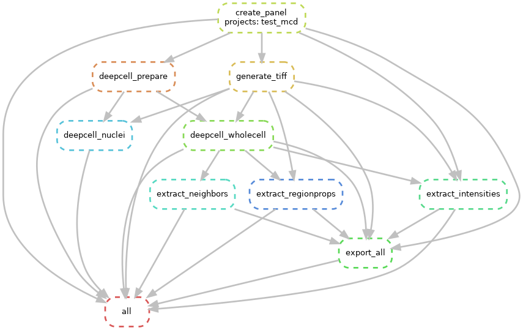

# Steinbock-snakemake v0.0.4

## Overview

Run the [steinbock](https://github.com/BodenmillerGroup/steinbock) workflow as a scalable module to process raw IMC data into files usable for visualization tools and downstream analysis. 

This pipeline uses mesmer to segment cells and nuclei, generate neighbors and finally outputs files required for downstream analysis. 
The `steinbock` functionality is wrapped with [snakemake](https://snakemake.readthedocs.io/en/stable/) to make computations more efficient and compatible
with cluster and grid environments 




## Set-up pipeline environment (via conda, pip)

We will first set up the pipeline environment via conda and pip. This will install all dependencies including snakemake and singularity for use.

```
git clone https://github.com/camblab-bioml/steinbock_snakemake && cd steinbock_snakemake # clone git repo, then move into the pipeline folder. 
conda env create -y --file=workflow/env/environment.yml
conda activate steinbock-snakemake
```

## Running Steinbock-snakemake

### Data input and output structures
Now that the containers and environment is set-up, we will run and test the pipeline on a small mcd file. 

Use the following command to copy the test dataset into the `data` directory:

```commandline
cp -r tests/test_mcd/ data/
```

After copying, the structure of the input data folder should appear as follows:
```
── 📁data
    └── 📁test_mcd
        └── 📁mcd # Folder for you XTi mcd file or Hyperion mcd file. .txt files are also supported.
            └── test.mcd
```

### Creating a new project
Each project is given a directory under the data folder. To create a new project, make a new folder under `data/yourproject` and add a `data/yourproject/mcd` folder. Drag and drop your `yourproject.mcd` into the mcd folder. The minimum requirement for the project folder structure is as shown:
```
── 📁data
    └── 📁yourproject
        └── 📁mcd # Folder for you XTi *.mcd file or Hyperion *.mcd file. Hyperion *.txt files are also supported.
            └── test.mcd
```

### Preflight configuration
Before running the pipeline, we will first take a look at the configuration file `config/config.yaml`. This will store important information regarding the settings for each analysis module. The structure of the config file is as follows:
```
projects:
  - test_mcd # Informs the snakemake pipeline which projects to process

# Options for mesmer_pipeline
seed: 123L
hpf: 5 # hot pixel filter
nuclear: "Ir191" # Nuclear Channel. For multiple channels the syntax is "Ir191 Ir193 Dy162"
cytoplasm: "Gd158" # Cytoplasm Channel. For multiple channels the syntax is "Ir191 Ir193 Dy162"
deepcell_app: "mesmer"
deepcell_model: "MultiplexSegmentation"
deepcell_modelpath: "/opt/keras/models"
deepcell_pxsize: 1
aggr: "mean" # Aggregation of signal. Can be either of these [mean|median]
neighbor_type: "borders" # Consideration of each neighbor
dmax: 15 # Max centroid to centroid distance 
kmax: 5 # Max number of neighbors


phenograph_k: 30 # Number of kearest neighbors to use for phenograph
phenograph_min_cluster_size: 10 # Minimum number of cells requires for a cluster to be designated as a true cluster

umap_min_dist: [0, 0.1, 0.25, 0.5, 1] # run the UMAP for every distance value passed
```

Under the `projects` configuration, add your folder name and the pipeline will process the mcd files in that folder, if you had not already done so. We will use the `test_mcd` project in this demonstration. 
```
projects:
    - test_mcd
```

### Channels for segmenting cells
To help mesmer segment cells, steinbock will require the user to input the mass channels for cytoplasm specific markers (e.g panCK, Actin etc). You should include those channels under `cytoplasm` and `nuclear`
```
nuclear: "Ir191" # Nuclear Channel. For multiple channels the syntax is "Ir191 Ir193 Dy162"
cytoplasm: "Gd158" # Cytoplasm Channel. For multiple channels the syntax is "Ir191 Ir193 Dy162" 
```

### Extracting features
After generating segmenting masks, steinbock will proceed to extract single-cell features (intensities, neighbors, region properties etc.)
```
aggr: "mean" # Aggregation of signal. Can be either of these [mean|median]
neighbor_type: "borders" # Consideration of each neighbor
dmax: 15 # Max distance
kmax: 5 # Max number of neighbors
```

### Downstream channels

Users should be cautious about which channels are selected for use in downstream analysis
tasks such as UMAP projections and clustering. Certain channels such as gas channels (Argon, Xenon, etc.)
can confound the cluster assignment and UMAP coordinates for IMC datasets and may not be biologically relevant.
To remove these channels from these tasks, users should set the `channels_ignore_umap` config input as follows:

```
channels_ignore_umap: "ArAr80 Xe126 Xe131 Xe134" # proper syntax is space separated for each channel
```
In the example above, the pipeline will ignore 4 channels corresponding to gas measurements.
This often leads to cleaner phenograph cluster assignments and better resolution for UMAPs.
Note that this input should be changed to reflect the appropriate channel names set by the user.


### Basic clustering and dimension reduction

The steinbock pipeline will additionally perform basic subpopulation cluster analysis 
using [phenograph](https://github.com/dpeerlab/phenograph) and dimension reduction 
with [UMAP](https://github.com/lmcinnes/umap). The following parameters in the configuration file
control the behavior of the phenograph clustering algorithm:

```
phenograph_k: 30 # Number of kearest neighbors to use for phenograph
phenograph_min_cluster_size: 10 # Minimum number of cells requires for a cluster to be designated as a true cluster
```

The exported anndata object that follows the naming pattern `{project}.h5ad` will contain these 
outputs in the following anndata slots:

- clustering will be found in the `phenograph` column of the `obs` slot

### UMAP

The pipeline will be default run UMAP with the following minimum distance values between 0 and 1:
0, 0.1, 0.25, 0.5, 1. These values can be changed by passing a list of values in the config as 'umap_min_dist';

```
umap_min_dist: [0, 0.1, 0.25, 0.5, 1] # run the UMAP for every distance value passed
```

smaller UMAP distance values produce tighter more dispersed clusters, while larger values
create fewer clusters and a more uniform manifold. 

The UMAP coordinates for every distance used are stored in the `umap` sub-directory of the 
`export` output directory. Each distance is also plotted alongside the phenograph clustering to
give users a general idea of cluster dispersion for different distance metrics. 


### Project specific configuration
After editing `config.yml`, we would want to ensure we use the same settings for each project. A simple solution is to copy the `config.yml` file over to the project directory before calling the snakemake, and directing it to the config file. 
```
cp config/config.yaml data/test_mcd/test_mcd.yaml
```

### Running the snakemake pipeline
After completing the preflight configuration, we can run the pipeline. The `snakemake` command is invoked in the `steinbock-snakemake` directory:
1. Specify cores required using the `-c` flag.
2. Specify the configuration file to use using the `--configfile` flag.

```
cd ~/test_folder/steinbock_snakemake # navigate to the main directory where it is cloned
snakemake -c 4 --configfile data/test_mcd/test_mcd.yaml
```

### Inspect pipeline outputs

This concludes this tutorial!

The pipeline output directory structure for the current version is as follows:

```
└── 📁test_mcd
    └── 📁deepcell # outputs for deepcell segmentation and masks per ROI
        └── 📁intensities
            └── test_018.csv
        └── 📁neighbors
            └── test_018.csv
        └── 📁nuclei
            └── test_018.tiff
        └── 📁regionprops
            └── test_018.csv
        └── 📁whole_cell
            └── test_018.tiff
    └── 📁export # Exports per channel tiff for each ROI, an ome.tiff file and a anndata object
        └── 📁test_018
            └── ArAr80_80ArAr.tiff
            └── Dy162_162Dy_h5454_Chr10SAT.tiff
            └── Er166_166Er_h3838_Chr1SAT.tiff
            └── Er167_167Er_h3838_Chr1SAT.tiff
            └── Gd158_158Gd_h5050_Chr2SAT.tiff
            └── Ir191_191Ir_DNA1.tiff
            └── Ir193_193Ir_DNA2.tiff
            └── Pb206_206Pb.tiff
            └── Pb208_208Pb.tiff
            └── Xe126_126Xe.tiff
            └── Xe131_131Xe.tiff
            └── Xe134_134Xe.tiff
            └── test_018_mask.tiff
        └── test_018.ome.tiff
        └── test_mcd.h5ad
        └── scaling.json #used for rakaia visualization
        └── 📁umap
            └── umap_min_dist...coordinates.csv
            └── umap_min_dist...png
    └── 📁img # Multichannel Tiff folder
        └── images.csv
        └── test_018.tiff
    └── 📁mcd
        └── test.mcd
    └── panel.csv # panel file containing all markers
    └── panel_deepcell.csv # panel file containing markers for nuclear and cytoplasm segmentation
    └── test_mcd.yaml
```
